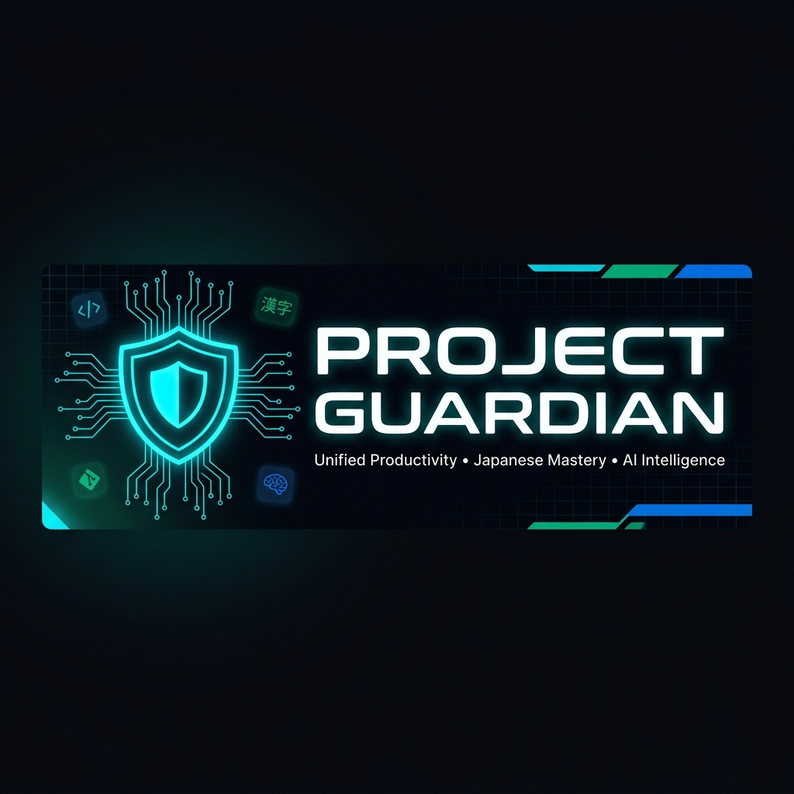
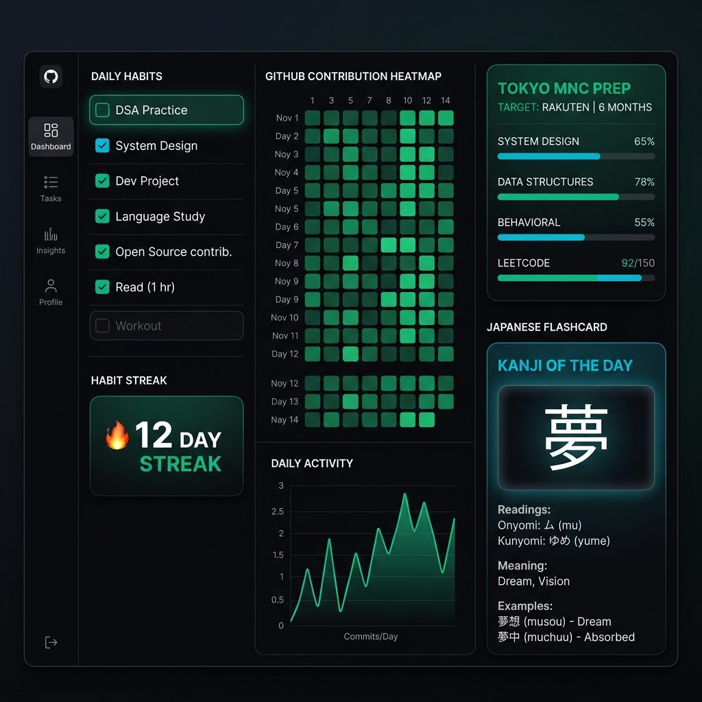
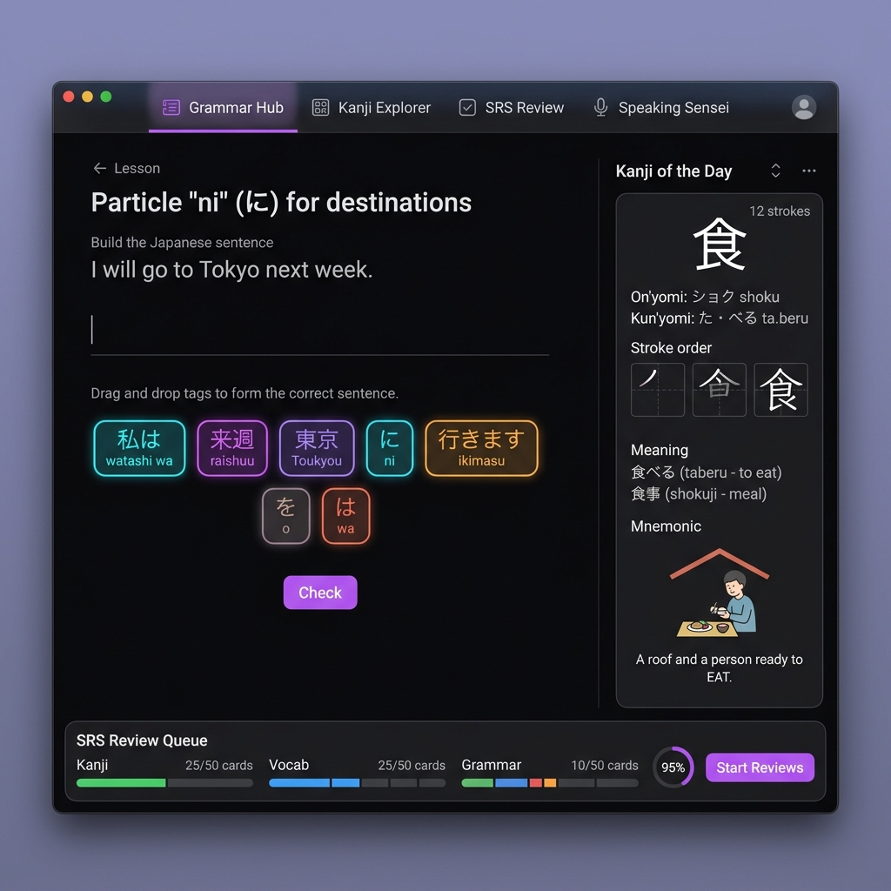
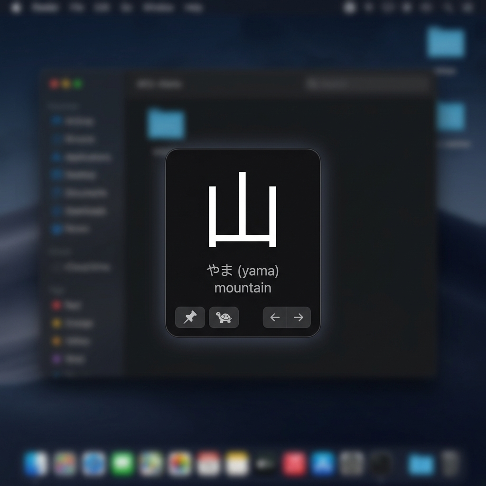
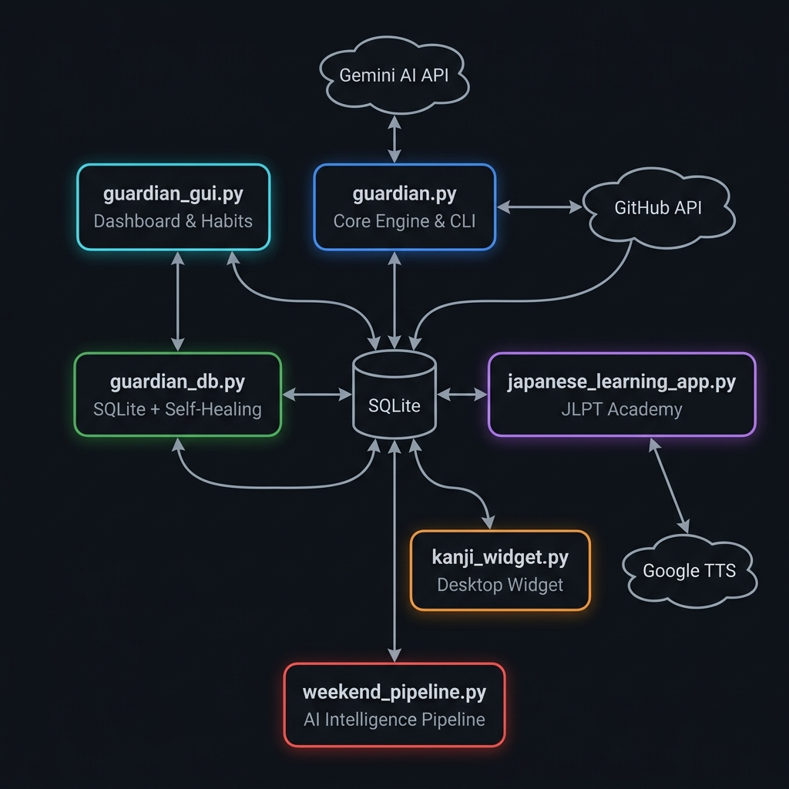
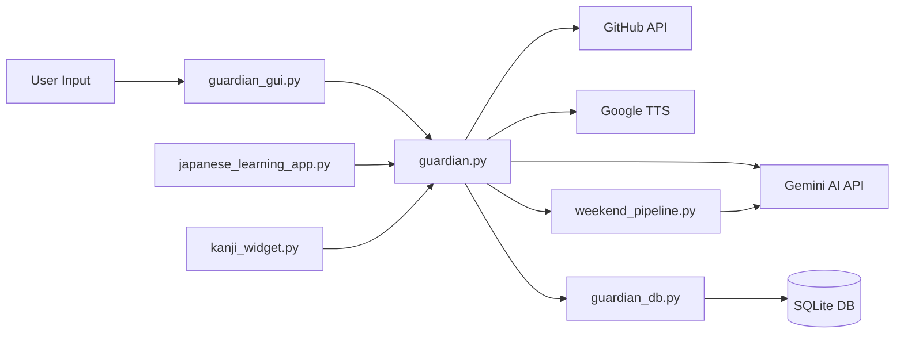

<p align="center">
  
</p>

<h1 align="center">🛡️ Project Guardian</h1>

<p align="center">
  <strong>Unified Productivity Suite • Japanese Mastery Academy • AI Intelligence Pipeline</strong>
</p>

<p align="center">
  <a href="https://www.python.org/"></a>
  <a href="#"></a>
  <a href="#"></a>
  <a href="#"></a>
  <a href="#"></a>
  <a href="#"></a>
  <a href="LICENSE"></a>
</p>

<p align="center">
  <em>An elite, AI-powered desktop workspace suite that combines daily habit auditing, live GitHub commit syncing, full-spectrum Japanese language learning, spaced repetition, native Speech-to-Speech conversation, and a dynamic AI intelligence pipeline for career preparation — all wrapped in a premium Apple Space Black dark UI.</em>
</p>

---

## 📸 Preview

<p align="center">
  
  <br/>
  <em>Guardian Dashboard — Habit Tracking, GitHub Heatmap, and Tokyo MNC Prep</em>
</p>

<details>
<summary>🎓 Japanese Academy & 📌 Desktop Widget Screenshots</summary>
<br/>
<p align="center">
  
  <br/><em>Full-screen JLPT Academy — Grammar Hub, Kanji Explorer, SRS Reviews, AI Speaking Sensei</em>
</p>
<p align="center">
  
  <br/><em>Always-on-top Frameless Kanji Desktop Companion Widget</em>
</p>
</details>

---

## ✨ Features at a Glance

| Module | Highlights |
|:---|:---|
| 🛡️ **Guardian Dashboard** | Daily habit checklist with inline add/delete, 14-day GitHub contribution heatmap, streak tracking, automated compliance audits |
| 🎓 **Japanese Academy** | 4,200+ lines of JLPT curriculum (N5→N1), Grammar Hub with interactive sentence builder, Kanji Explorer with AI-generated cards |
| 🧠 **Spaced Repetition** | Mathematical SM-2 algorithm, SQLite-backed intervals, WaniKani-style radical decompositions and visual mnemonics |
| 🎙️ **AI Speaking Sensei** | Native Speech-to-Speech using WinMM.dll recording, Gemini multimodal transcription, inline grammar breakdowns |
| 📌 **Desktop Widget** | Frameless always-on-top kanji flashcards, focus-stealing pop-up quizzes, slow-speed TTS toggle |
| 🗺️ **Tokyo MNC Prep** | Dynamic AI-generated weekly curriculum, tech trend intelligence, career radar for Japanese MNCs |
| 🔬 **Research Portal** | Live arXiv search console, trending CS research spotlights, weekend study task synthesis |
| 🔧 **Self-Healing** | Automatic crash detection, config repair, SQLite schema migration, graceful degradation |

---

## 🏗️ Architecture

<p align="center">
  
</p>

### System Architecture Overview

Project Guardian is built as a **modular monolith** — six Python modules that share a common SQLite database and communicate through a core engine layer. This architecture provides the simplicity of a single deployment with clean separation of concerns.

```
┌──────────────────────────────────────────────────────────────────────┐
│                        USER INTERFACE LAYER                         │
│                                                                      │
│   ┌──────────────┐  ┌──────────────────┐  ┌──────────────────────┐  │
│   │ guardian_gui  │  │ japanese_learning │  │   kanji_widget       │  │
│   │   .py         │  │    _app.py        │  │      .py             │  │
│   │              │  │                  │  │                      │  │
│   │ • Dashboard  │  │ • Grammar Hub    │  │ • Frameless card     │  │
│   │ • Habits     │  │ • Kanji Explorer │  │ • Pop-up quizzes     │  │
│   │ • Heatmap    │  │ • SRS Reviews    │  │ • Always-on-top      │  │
│   │ • Research   │  │ • AI Sensei      │  │ • Drag & Pin         │  │
│   └──────┬───────┘  └────────┬─────────┘  └──────────┬───────────┘  │
│          │                   │                       │              │
├──────────┼───────────────────┼───────────────────────┼──────────────┤
│          ▼                   ▼                       ▼              │
│   ┌─────────────────────────────────────────────────────────────┐   │
│   │                    CORE ENGINE LAYER                         │   │
│   │                      guardian.py                             │   │
│   │                                                             │   │
│   │  • Gemini AI Client (query, fallback, caching)              │   │
│   │  • GitHub API Integration (commit checking)                 │   │
│   │  • Google TTS / Windows SAPI Speech Pipeline                │   │
│   │  • CLI Task Runner & Windows Task Scheduler                 │   │
│   │  • Local Kanji Fallback Pool (zero-lag card generation)     │   │
│   └────────────────────────────┬────────────────────────────────┘   │
│                                │                                    │
├────────────────────────────────┼────────────────────────────────────┤
│                                ▼                                    │
│   ┌──────────────────────┐  ┌──────────────────────────────────┐   │
│   │   guardian_db.py      │  │     weekend_pipeline.py          │   │
│   │                      │  │                                  │   │
│   │ • SQLite ORM         │  │ • 5-Stage AI Pipeline            │   │
│   │ • SM-2 SRS Engine    │  │ • Trend Discovery                │   │
│   │ • Self-Healing       │  │ • Curriculum Synthesis           │   │
│   │ • Schema Migration   │  │ • Career Intelligence            │   │
│   │ • Crash Recovery     │  │ • Quality Audit                  │   │
│   └──────────┬───────────┘  └──────────────┬───────────────────┘   │
│              │                             │                       │
├──────────────┼─────────────────────────────┼───────────────────────┤
│              ▼                             ▼                       │
│   ┌────────────────────────────────────────────────────────────┐   │
│   │                  EXTERNAL SERVICES                          │   │
│   │                                                            │   │
│   │  ☁️  Gemini 3.5 Flash API    (AI generation, speech)       │   │
│   │  ☁️  GitHub REST API          (commit verification)         │   │
│   │  ☁️  Google Translate TTS     (native pronunciation)        │   │
│   │  🖥️  Windows SAPI             (offline TTS fallback)        │   │
│   │  🖥️  WinMM.dll MCI            (native audio recording)     │   │
│   └────────────────────────────────────────────────────────────┘   │
│                                                                     │
│   ┌────────────────────────────────────────────────────────────┐   │
│   │                  DATA PERSISTENCE                           │   │
│   │                                                            │   │
│   │  💾 guardian_db.sqlite   (habits, streaks, SRS intervals)  │   │
│   │  📄 config.json          (API keys, preferences)           │   │
│   │  📄 gemini_cache.json    (AI response caching)             │   │
│   └────────────────────────────────────────────────────────────┘   │
└──────────────────────────────────────────────────────────────────────┘
```

### Data Flow



---

## 🚀 Module Deep Dive

### 1. 🛡️ Guardian Dashboard (`guardian_gui.py` — 2,226 lines)

The command center for your daily productivity. Built with native Tkinter Canvas for maximum performance.

<details>
<summary>📋 Feature Breakdown</summary>

- **Daily Habit Tracker** — Inline `➕ ADD HABIT` entry and `🗑️` delete buttons directly on the dashboard. Tracks custom habits (DSA, dev-project, language-study, etc.) with real-time SQLite persistence.
- **14-Day GitHub Heatmap** — A visual Git-style contribution grid rendered on Canvas, showing your last 14 days of commit activity with varying intensity shades of green.
- **Live GitHub Sync** — Asynchronous background thread checks your GitHub profile for today's commits on startup and on-demand. Shows ✅ or ❌ status in real-time.
- **Streak Engine** — Calculates and displays consecutive-day streaks with 🔥 fire indicators. 7-day and 30-day perfect compliance metrics.
- **Compliance Auditor** — Automated 23:45 daily audit that checks all habits and dispatches push notification warnings via ntfy.sh if tasks are incomplete.
- **Research Portal Tab** — Embedded arXiv keyword search console with live XML parsing and background-threaded result rendering.

</details>

### 2. 🎓 Japanese Academy (`japanese_learning_app.py` — 4,238 lines)

A full-screen immersive JLPT preparation environment, the largest module in the suite.

<details>
<summary>📋 Feature Breakdown</summary>

- **JLPT Level Selector** — Global N5→N1 difficulty switch that recalibrates all content (grammar lessons, kanji decks, sentence complexity, AI tutor responses).
- **Grammar Hub** — 10+ structured lessons covering particles (は, が, を, に, で, へ), verb conjugations, and sentence patterns. Interactive neon-glow word pills for drag-and-drop sentence construction.
- **Kanji Explorer** — Visual grid of all studied kanji marked ✓ (studied) or 🔒 (locked). AI-powered progressive generator creates new cards matching your exact level — no duplicates.
- **SRS Review Center** — Mathematical SM-2 spaced repetition algorithm with SQLite-backed intervals. Fluid 150ms height-transition flashcard reveals showing Kunyomi, Onyomi, vocabulary, and radical decompositions.
- **🎙️ Speaking Sensei (Speech-to-Speech)** — Record voice using native WinMM.dll MCI commands (zero external audio dependencies). Pulsing crimson `🔴 REC (5s)...` countdown. Audio encoded to base64 and sent to Gemini for multimodal transcription + Japanese response.
- **💡 Deep Explanation Panels** — Click `EXPLAIN` on any Sensei response to get inline breakdowns: Grammar & Structure, Vocabulary & Readings, Particles, Formality & Nuance.
- **Offline Scenarios** — Pre-built conversation trees (Restaurant, Hotel Check-In, etc.) for offline study.

</details>

### 3. 📌 Kanji Desktop Widget (`kanji_widget.py` — 1,008 lines)

A minimal, frameless always-on-top companion widget that lives on your desktop.

<details>
<summary>📋 Feature Breakdown</summary>

- **Frameless Design** — Custom window with no title bar, draggable anywhere on screen with `📌` pin toggle for always-on-top.
- **Zero-Lag Cards** — Asynchronous pre-fetch cache buffer loads next card in <1ms. Local fallback pool automatically recycles when exhausted for infinite instant cards.
- **🐢 Slow Speed Toggle** — Reduces TTS speech rate by 40% for precise syllable-level comprehension practice.
- **⏰ Pop-Up Quizzes** — Focus-stealing multiple-choice questions that appear at configurable intervals (1–60 min). Correct/incorrect answers dynamically adjust SRS intervals.
- **History Navigation** — `←` `→` buttons to browse through previously studied cards.

</details>

### 4. 🗺️ Weekend Intelligence Pipeline (`weekend_pipeline.py` — 217 lines)

A 5-stage AI-powered pipeline that generates personalized weekly study curricula.

<details>
<summary>📋 Pipeline Stages</summary>

| Stage | Purpose |
|:---|:---|
| **Stage 1**: Trend Discovery | Scans 2026 tech landscape for emerging frameworks, tools, and hiring signals |
| **Stage 2**: Curriculum Synthesis | Generates a customized technical study plan based on your history and skill gaps |
| **Stage 3**: Business Manners & Keigo | Prepares Japanese corporate etiquette and formal language training |
| **Stage 4**: Checklist & Resources | Produces actionable weekend task checklists with linked resources |
| **Stage 5**: Quality Audit | Validates output freshness (no outdated pre-2026 data) and logical progression |

**Output Fields**: `task_title`, `tech_upscaling`, `personality_upscaling`, `weekly_intel_summary`, `research_spotlight`, `trending_topics`, `career_radar`, `action_checklist`, `github_repos`, `source_label`

</details>

### 5. 🔧 Core Engine & CLI (`guardian.py` — 2,000 lines)

The backbone shared by all UI modules.

<details>
<summary>📋 Feature Breakdown</summary>

- **Gemini AI Client** — Unified API wrapper with model selection (`gemini-3.5-flash`), structured JSON prompts, response caching, and fast-fail 429 quota handling with instant local fallback.
- **GitHub Integration** — REST API calls to verify daily commit activity against your profile.
- **Dual TTS Pipeline** — Primary: Google Translate TTS for native pronunciation. Fallback: Windows SAPI `System.Speech.Synthesis` via hidden WMP COM handles for offline speech.
- **CLI Task Runner** — Full command-line interface with color-coded ANSI output for headless operation.
- **Windows Task Scheduler** — Register/unregister automated daily background audit jobs.

</details>

### 6. 💾 Database & Self-Healing (`guardian_db.py` — 1,218 lines)

Resilient data layer with automatic crash recovery.

<details>
<summary>📋 Feature Breakdown</summary>

- **SQLite ORM** — Custom lightweight ORM managing habits, streaks, kanji SRS intervals, study history, and weekend pipeline logs.
- **SM-2 SRS Engine** — Full implementation of the SuperMemo SM-2 algorithm: easiness factor, interval calculation, repetition scheduling.
- **Self-Healing System** — On startup: detects previous crashes via `running` flag, repairs corrupted `config.json` by merging missing keys from defaults, validates and migrates SQLite schema.
- **Crash Recovery** — Logs all crash events to `gui_crash_log.txt` with timestamps. Automatically restores clean state.

</details>

---

## 🎨 Design System

The entire suite follows a cohesive **Apple Space Black** premium dark theme:

| Token | Hex | Usage |
|:---|:---|:---|
| `BG_DARK` | `#09090B` | Primary background (Midnight) |
| `BG_CARD` | `#121214` | Card surfaces (Space Black) |
| `BG_INNER` | `#1C1C1E` | Inner containers (Apple Dark Gray) |
| `FG_LIGHT` | `#F5F5F7` | Primary text (Apple White) |
| `FG_SECONDARY` | `#8E8E93` | Muted labels (Apple Gray) |
| `ACCENT_CYAN` | `#0071E3` | Primary interactive (Apple Blue) |
| `ACCENT_GREEN` | `#30D158` | Success/completed (Apple Green) |
| `ACCENT_RED` | `#FF453A` | Error/warning (Apple Red) |
| `ACCENT_ORANGE` | `#FF9F0A` | Stats/countdowns (Apple Orange) |
| `ACCENT_PURPLE` | `#BF5AF2` | Special icons (Apple Purple) |

**Micro-Animations**: 60fps progress bars, hover scaling effects, glowing green completion borders, pulsing record indicators, fluid 150ms card transitions.

**Acoustic Feedback**: Real-time `winsound` chimes on task completion, quiz correct/incorrect, and SRS card reviews.

---

## 🛠️ Tech Stack

| Layer | Technology | Purpose |
|:---|:---|:---|
| **Language** | Python 3.8+ | Core application logic |
| **UI Framework** | Tkinter + Canvas | Native desktop GUI with custom widgets |
| **Database** | SQLite3 | Local persistent storage (habits, SRS, streaks) |
| **AI Engine** | Google Gemini 3.5 Flash | Text generation, speech transcription, curriculum synthesis |
| **Speech Synthesis** | Google TTS + Windows SAPI | Dual-pipeline pronunciation (online/offline) |
| **Audio Capture** | WinMM.dll MCI (via PowerShell) | Native mic recording — zero external audio packages |
| **HTTP** | `requests` library | REST API calls (GitHub, Gemini, TTS) |
| **Scheduling** | Windows Task Scheduler | Automated daily compliance audits |
| **Notifications** | ntfy.sh | Push notifications for missed habits |

> **Zero external audio dependencies.** Unlike typical Python audio apps that require PyAudio, sounddevice, or portaudio, Project Guardian uses Windows' built-in MCI sound commands through PowerShell for completely dependency-free audio recording.

---

## 📂 Project Structure

```
guardian-tracker/
│
├── 🛡️  guardian.py                  # Core engine: AI client, GitHub API, TTS, CLI (2,000 LOC)
├── 📊  guardian_gui.py              # Dashboard GUI: habits, heatmap, research (2,226 LOC)
├── 💾  guardian_db.py               # SQLite ORM, SM-2 SRS, self-healing (1,218 LOC)
├── 🎓  japanese_learning_app.py     # Full JLPT Academy: grammar, kanji, sensei (4,238 LOC)
├── 📌  kanji_widget.py              # Frameless desktop flashcard widget (1,008 LOC)
├── 🗺️  weekend_pipeline.py          # 5-stage AI intelligence pipeline (217 LOC)
│
├── 🔧  config.json                  # API keys, preferences, GitHub username
├── 💾  guardian_db.sqlite           # SQLite database (habits, SRS, streaks)
├── 📄  gemini_cache.json            # AI response cache for offline access
├── 🎤  record_audio.ps1             # PowerShell MCI audio capture script
├── 🏥  check_startup.py             # Windows startup registration utility
│
├── 📁  assets/                      # README images and visual assets
│   ├── banner.png
│   ├── architecture.png
│   ├── dashboard_preview.png
│   ├── japanese_academy.png
│   └── kanji_widget.png
│
└── 📄  README.md                    # This file
```

**Total Codebase**: ~10,900 lines of Python across 6 core modules.

---

## 📦 Installation

### Prerequisites

- **OS**: Windows 10/11
- **Python**: 3.8 or higher
- **Gemini API Key**: [Get one free](https://aistudio.google.com/app/apikey)

### Quick Start

```powershell
# 1. Clone the repository
git clone https://github.com/aditya-dev06/project-gurdian.git
cd project-gurdian

# 2. Create virtual environment (recommended)
python -m venv venv
.\venv\Scripts\activate

# 3. Install dependencies (minimal — only 2 packages!)
pip install requests pillow

# 4. Configure your API key
# Edit config.json or use the in-app settings panel
```

### Configuration (`config.json`)

```json
{
    "gemini_api_key": "YOUR_GEMINI_API_KEY",
    "github_username": "your-github-username",
    "tracked_tasks": ["dsa", "dev-project", "language-study"],
    "audit_time": "23:45",
    "japan_mnc_prep_active": true,
    "startup_enabled": true
}
```

### Launch

```powershell
# 🛡️ Guardian Dashboard (main entry point)
python guardian_gui.py

# 🎓 Japanese Academy (standalone)
python japanese_learning_app.py

# 📌 Desktop Kanji Widget (standalone companion)
python kanji_widget.py

# ⌨️ CLI Mode (headless)
python guardian.py status
```

---

## ⌨️ CLI Reference

The CLI companion (`guardian.py`) provides full headless control:

| Command | Description |
|:---|:---|
| `python guardian.py status` | Print visual board of all habits with live GitHub commit check |
| `python guardian.py done <task>` | Mark a daily task as completed (e.g., `done dsa`) |
| `python guardian.py stats` | Display 7-day/30-day compliance metrics and streak data |
| `python guardian.py schedule` | Register automated daily audit in Windows Task Scheduler |
| `python guardian.py unschedule` | Remove scheduled background audit jobs |
| `python guardian.py test-warn` | Dispatch a test push notification via ntfy.sh |

---

## 🔄 Self-Healing System

Project Guardian is designed to **never crash permanently**. The self-healing subsystem in `guardian_db.py` performs the following on every startup:

```
Startup Sequence
    │
    ├─► Check config.json integrity
    │   ├── Missing? → Regenerate from defaults
    │   └── Corrupted? → Merge missing keys, preserve valid data
    │
    ├─► Detect previous crash (via `running` flag)
    │   ├── Clean exit → Continue normally
    │   └── Dirty exit → Log crash event, initiate repair
    │
    ├─► Validate SQLite database
    │   ├── Missing tables? → Create with correct schema
    │   ├── Schema mismatch? → Migrate columns
    │   └── Corruption? → Rebuild from backup
    │
    └─► Set `running = true` → Begin session
```

---

## 🧠 SM-2 Spaced Repetition Algorithm

The SRS engine implements the proven **SuperMemo SM-2** algorithm:

```
IF answer_quality ≥ 3 (correct):
    IF repetitions == 0: interval = 1 day
    IF repetitions == 1: interval = 6 days
    ELSE: interval = previous_interval × easiness_factor

    easiness_factor += (0.1 - (5 - quality) × (0.08 + (5 - quality) × 0.02))
    easiness_factor = max(1.3, easiness_factor)
    repetitions += 1

ELSE (incorrect):
    repetitions = 0
    interval = 1 day
```

Cards are stored in SQLite with their next review date, allowing precise scheduling across sessions.

---

## 🤝 Contributing

1. **Fork** the repository
2. **Create** a feature branch (`git checkout -b feature/amazing-feature`)
3. **Commit** your changes (`git commit -m 'feat: add amazing feature'`)
4. **Push** to the branch (`git push origin feature/amazing-feature`)
5. **Open** a Pull Request

---

## 📜 License

This project is licensed under the **MIT License** — see the [LICENSE](LICENSE) file for details.

---

<p align="center">
  <strong>Built with 🛡️ discipline and 🇯🇵 passion</strong>
  <br/>
  <em>by <a href="https://github.com/aditya-dev06">Aditya Prakash</a></em>
</p>
